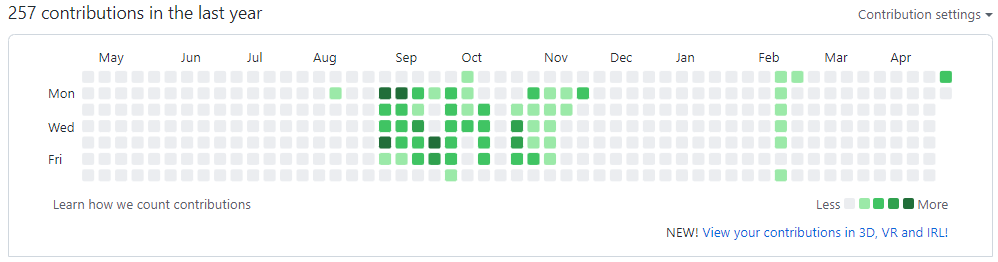

# 이력서
## 소개

* 이름 : 김영찬
* 군필여부 : 사회복무요원 복무완료
* 취미 : 배드민턴, **코딩**, 기획
* Email : rladudcks5477@gmail.com
* GitHub : [github.com/dudcks5477](github.com/dudcks5477)
* instagram : [zeorchan_98](instagram.com/zerochan_98/)

```
 Project Manager가 되는 것이 목표이며,새롭게 시도하는 것을 좋아합니다.
```


## 학력
* 한림대학교 빅데이터전공 3학년 재학(2018 입학)
* 수택고등학교 졸업 (2015 ~ 2018)
* 미금중학교 졸업(2011 ~ 2015)

## 사용기술
### Frontend
기획부터 제작까지 자연스러운 웹을 만들 정도의 스킬을 가지고 있습니다.
* HTML + CSS + JavaScript
* Reactjs, Vuejs

### Backend
간단한 서버 테스트 정도의 스킬을 가지고 있습니다.
* nodejs

### Android
* Kotlin
* Java